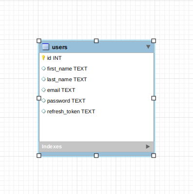
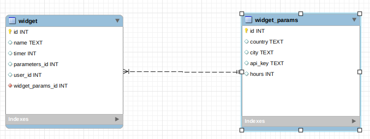
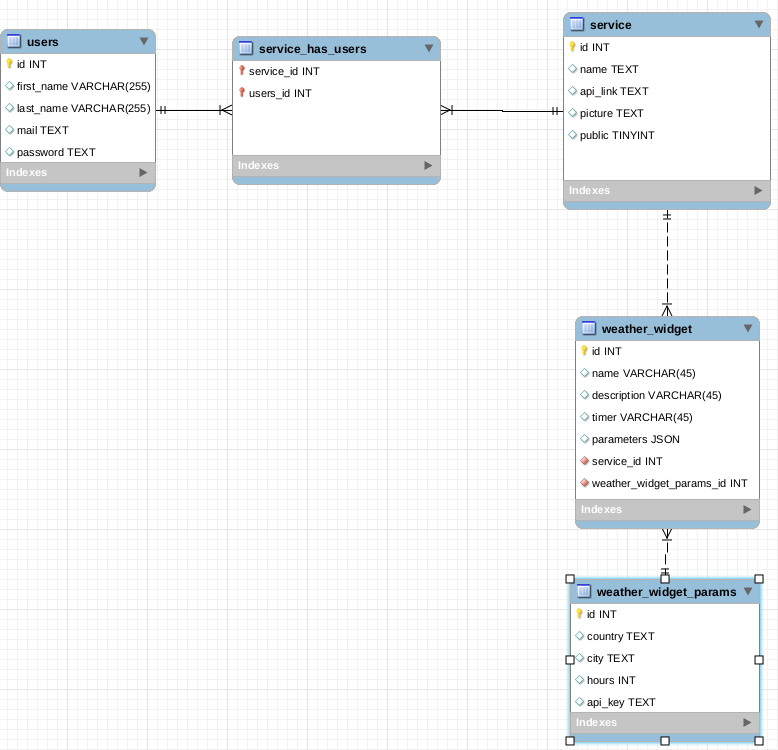

# DEV_dashboard_2019

# Services

### User 

### Weather

# DATABASE

* To create database from script, run following command from project source : 
> docker exec -i database mysql -umonty -pmonty < doc/dump.sql;

